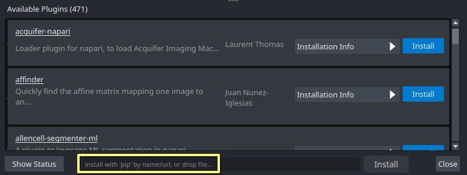

(find-and-install-plugins)=
# Finding and installing plugins

Information about available plugins can be found in the following places:
- **PyPI:** napari plugins are Python packages distributed on the Python Package Index
  (PyPI), and annotated with the
  tag [`Framework :: napari`](https://pypi.org/search/?q=&o=&c=Framework+%3A%3A+napari) 
- **conda-forge:** You can search for napari plugins from
  the conda-forge [package search page](https://conda-forge.org/packages/).
- **napari hub:** The [napari hub](https://napari-hub.org) uses this data, together with additional
  metadata, to produce a more user-friendly way to find napari plugins.

Similarly, the napari application lists plugins, annotated on PyPI with `Framework :: napari`,
in the `Plugins > Install/Uninstall Plugins` menu.

## Installing plugins with napari

All PyPI packages annotated with the `Framework :: napari` tag can be installed
directly from within napari, using the [napari plugin manager](https://napari.org/napari-plugin-manager/).
To install a new plugin, click the "Plugins" menu and select "Install/Uninstall Plugins...".
Then, in the plugin installer menu that opens, you can either:


1. Install plugins from the list: you can scroll through the list of “Available Plugins”, or
   filter plugins using the text box at the top of the dialog. From the list,
   you can then install a plugin by clicking the `Install` button in the
   tile of the plugin you want to install. You can also uninstall or update
   plugins from this dialog in a similar way under the "Installed Plugins" section.

2. Install plugins via manual input: at the bottom of the napari plugin manager window, where it says "install with 'pip' by name/url, or drop file...",
    enter the name of the plugin you want to install (or *any* valid pip
    [requirement
    specifier](https://pip.pypa.io/en/stable/reference/requirement-specifiers/)
    or [VCS scheme](https://pip.pypa.io/en/stable/topics/vcs-support)). Then click
    the "Install" button next to the input bar. This method allows for more flexibility
    in the plugins you can install, but it is also a bit more advanced.

   

   ```{admonition} Example
   If you want to install `napari-svg` directly from the development branch on the [github repository](https://github.com/napari/napari-svg), enter `git+https://github.com/napari/napari-svg.git` in the text field.
   ```
